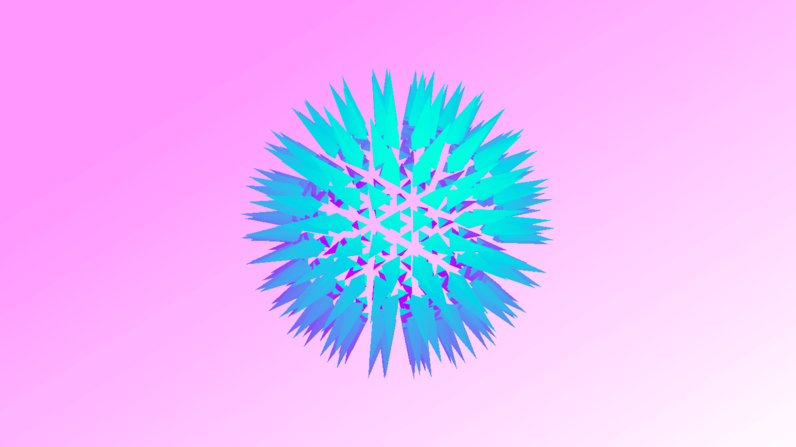

# Experiment 5

## Breathing Icosahedron
Exploded sphere geometry in Three.js. Using a similar method to experiment #4, All faces have been disconnected from the original geometry so that they may be moved independently. Additional faces have been added to each of the outer faces and are animated after a delay.

Play around with the *size*, *speed* and *delay* variables and see how it behaves.

[Live demo](http://danieldelcore.com/lab/5)

## Initial setup 
- `npm install --global gulp-cli` : Install gulp globally
- `npm i` Install dependencies

## Building for development
- `gulp dev` : Build files will be output to the '.tmp' directory.

## Building for production
- `gulp build` : Build files will be output to the 'deploy' directory.

## Pushing a new release
- `gulp build` : Compile local changes
- `git add .` : Stage changes
- `git commit -m"change description"` : comment on your changes
- `git tag -a v1.0.0 -m "Change description"` : Add a new tagged release
- `git push --follow-tags` : Push staged changes and tags
